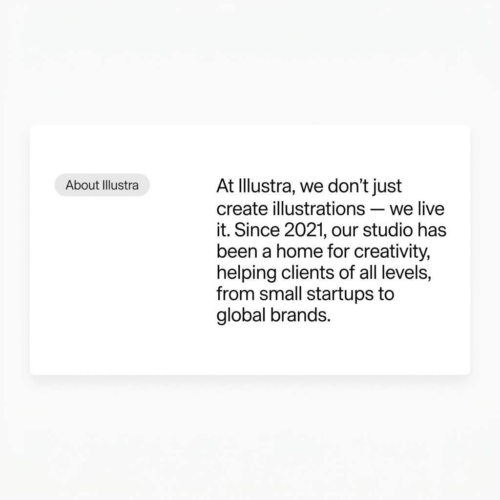

# Landing Page Structure — Illustration Service Website

## Website Goal
Website ini dibuat untuk menawarkan jasa pembuatan ilustrasi modern dengan fokus pada:
- Menampilkan portfolio visual
- Meningkatkan trust client
- Mengarahkan visitor ke WhatsApp CTA
- Menampilkan branding studio kreatif yang modern

---

# 1. Hero Section

## Tujuan
Menarik perhatian visitor dalam 3 detik pertama.

## Isi Section
- Headline utama
- Subheadline
- CTA button
- Preview illustration artwork
- Background visual modern
- Floating stats/client review

## Contoh Content

### Headline
Bring Your Ideas Into Stunning Illustrations

### Subheadline
Custom illustration service for branding, websites,
social media, UI assets, mascot design, and more.

### CTA Buttons
- Start Project
- View Portfolio
- Chat WhatsApp

## Visual
- Large hero image
- Gradient overlay
- Modern typography
- Glassmorphism card
- Floating elements

---

# 2. About Studio Section (Tentang Kami)

## Tujuan
Menjelaskan siapa kamu dan value jasa.

## Isi Section
- Short description studio
- Vision & mission
- Creative approach
- Experience

## Contoh Text
At Illustra, we don't just create illustrations — we live it. Since 2021, our studio has been a home for creativity, helping clients of all levels, from small startups to global brands.

## Visual

---

# 3. Trusted By Section

## Tujuan
Meningkatkan kredibilitas.

## Isi Section
- Logo client
- Brand partner
- Startup
- Agency
- Content creator

## Optional
Tambahkan:
- "100+ Happy Clients"
- "300+ Completed Projects"

---

# 4. Services Section

## Tujuan
Menjelaskan layanan yang tersedia.

## Isi Section

### Digital Illustration
Custom artwork for digital platforms.

### Website Illustration
Illustration assets for landing pages and UI design.

### Mascot Design
Character and mascot creation for brands.

### Social Media Illustration
Visual content for Instagram and campaigns.

### Book & Cover Illustration
Book covers, posters, album artwork.

### Motion Illustration
Animated illustrations for reels and videos.

## Visual
- Icon card
- Hover animation
- Modern grid layout

---

# 5. Portfolio Showcase

## Tujuan
Menampilkan hasil karya terbaik.

## Isi Section
- Illustration gallery
- Case studies
- Before & after
- Mockup presentation

## Category Filter
- Flat Illustration
- Cartoon
- Anime
- 3D Style
- Branding

## Layout Recommendation
- Masonry grid
- Bento grid
- Carousel slider

---

# 6. Working Process Section

## Tujuan
Menjelaskan alur kerja agar client lebih percaya.

## Isi Section

### Step 1 — Discuss Idea
Client menjelaskan kebutuhan project.

### Step 2 — Sketching
Pembuatan konsep awal ilustrasi.

### Step 3 — Revision
Revisi sesuai feedback client.

### Step 4 — Final Delivery
File final dikirim dalam kualitas tinggi.

## Visual
- Timeline horizontal
- Animated process card
- Icon illustration

---

# 7. Why Choose Us Section

## Tujuan
Menjelaskan kelebihan jasa.

## Isi Section

### Fast Response
Balasan cepat dan profesional.

### Unlimited Revision
Revisi sesuai paket.

### High Quality Artwork
Ilustrasi detail dan modern.

### Commercial License
Bisa digunakan untuk bisnis.

### Affordable Pricing
Harga kompetitif.

### Creative & Unique
Desain original dan tidak pasaran.

---

# 8. Pricing Section

## Tujuan
Memberikan gambaran harga.

## Isi Section

### Basic Package
- 1 Character
- PNG/JPG
- 2 Revisions

### Standard Package
- Detailed Illustration
- Source File
- Commercial Use

### Premium Package
- Full Custom Scene
- High Resolution
- Unlimited Revision

## Additional
- Delivery time
- File format
- Add-on service

---

# 9. Testimonials Section

## Tujuan
Meningkatkan trust visitor.

## Isi Section
- Client review
- Rating
- Profile photo
- Company/client name

## Visual
- Glassmorphism card
- Slider carousel
- Modern review layout

---

# 10. FAQ Section

## Tujuan
Menjawab pertanyaan umum visitor.

## Isi FAQ

### Berapa lama pengerjaan?
2–7 hari tergantung kompleksitas.

### Apakah bisa revisi?
Ya, sesuai paket yang dipilih.

### Format file apa saja?
PNG, JPG, SVG, AI, PSD.

### Bisa commercial use?
Ya.

### Pembayaran bagaimana?
Transfer bank / e-wallet.

---

# 11. CTA WhatsApp Section

## Tujuan
Mengubah visitor menjadi client.

## Isi Section

### Headline
Ready to Bring Your Ideas to Life?

### Description
Let’s create modern illustrations for your brand,
business, or personal project.

### CTA Button
Chat via WhatsApp

## WhatsApp Link
https://wa.me/628xxxxxxxxxx

## Visual
- Bright background
- Large CTA button
- Floating glow effect

---

# 12. Footer Section

## Isi Footer
- Logo
- Navigation links
- WhatsApp
- Email
- Instagram
- Behance
- Dribbble
- Copyright

## Optional
Tambahkan:
- Mini CTA
- Newsletter
- Social icons

---

# Recommended Website Flow

Hero
↓
About Studio
↓
Trusted By
↓
Services
↓
Portfolio
↓
Working Process
↓
Why Choose Us
↓
Pricing
↓
Testimonials
↓
FAQ
↓
CTA WhatsApp
↓
Footer

---

# Recommended Design Style

## Style
- Modern Minimal
- Bento Grid
- Glassmorphism
- Smooth Animation
- Large Typography

## UI Characteristics
- Rounded corner
- Soft shadow
- Gradient accent
- Hover interaction
- Clean spacing

---

# Recommended Colors

## Option 1 — Modern Lime
Primary: #C7FF1A
Dark: #111111
Background: #F5F5F0

## Option 2 — Creative Purple
Primary: #8B5CF6
Dark: #0F172A
Background: #F8FAFC

## Option 3 — Orange Creative
Primary: #FF7A00
Dark: #121212
Background: #FAFAFA

---

# Additional Modern Features

## Floating WhatsApp Button
Sticky CTA on mobile & desktop.

## Smooth Scroll Animation
Framer-motion style interaction.

## Infinite Marquee
Scrolling artwork showcase.

## Interactive Cursor
Modern glowing cursor effect.

## Hover Preview
Artwork preview on hover.

## Dark / Light Mode
Optional modern feature.

---

# Main Conversion Focus

## Prioritas Utama
1. Strong Hero Section
2. Beautiful Portfolio
3. Clear WhatsApp CTA
4. Trust Building
5. Mobile Responsive
6. Fast Loading
7. Modern UI Design